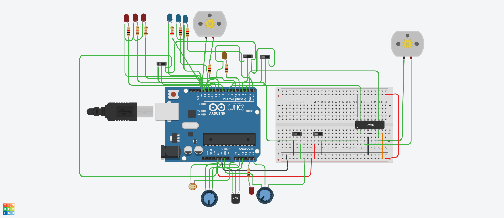
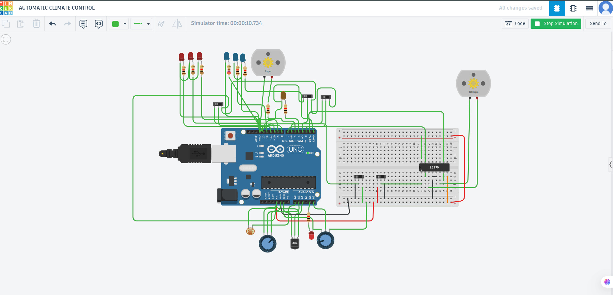
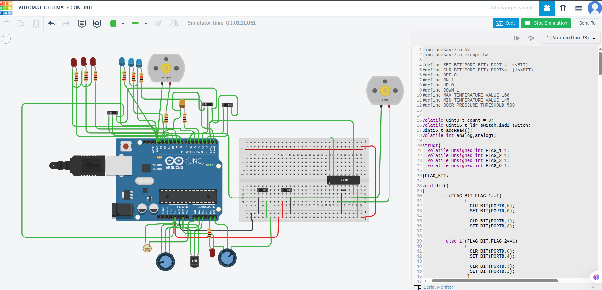
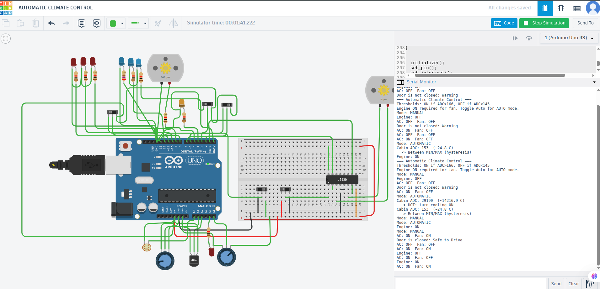
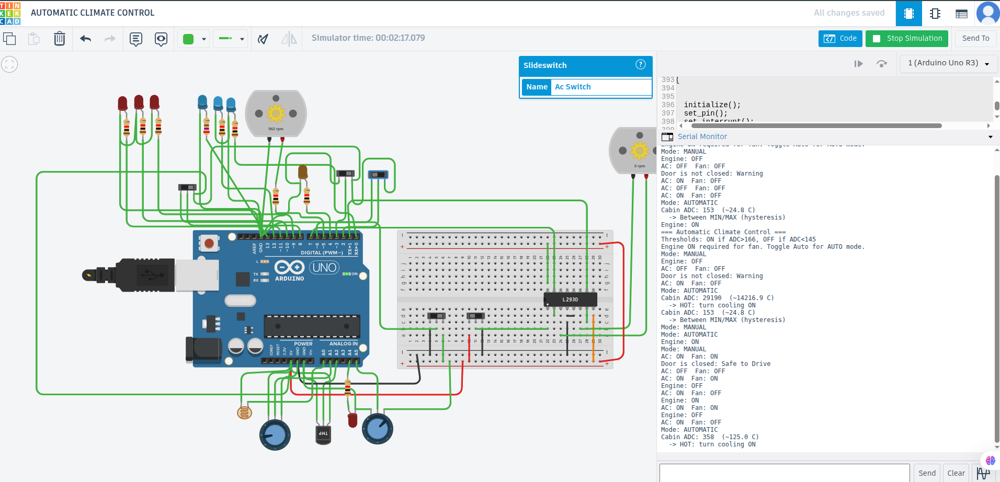
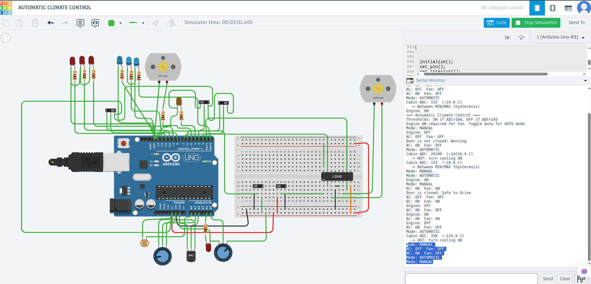
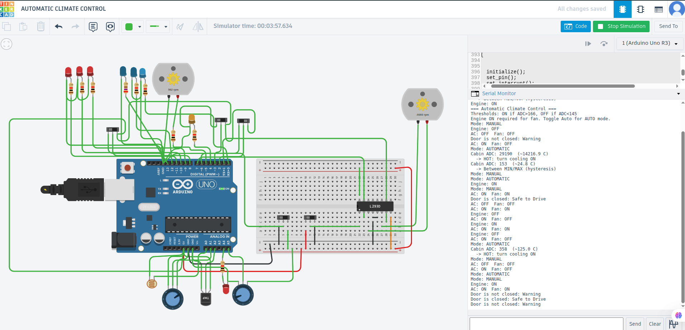
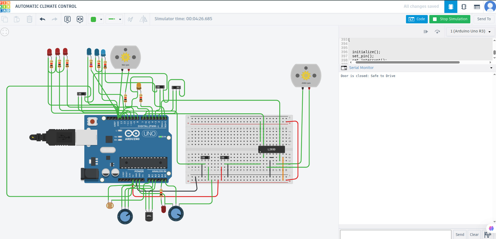

# Cover information

| Field | Details |
|:------|:--------|
| **Student name** | [Your full name] |
| **Registration / ID** | [Your ID] |
| **Course** | Embedded Systems Programming |
| **Instructor** | NGABO Desire |
| **Institution** | College of Science and Technology — School of ICT |
| **Date** | May 2026 |
| **Platform** | Arduino Uno R3 (ATmega328P) in Tinkercad Circuits |
| **Design reference** | Tinkercad public design 138054 |

# Executive summary

This report documents a **simulated vehicle embedded system** built in Tinkercad. The main function is **automatic climate control**: a TMP36 sensor measures cabin temperature, and the microcontroller turns an AC indicator (orange LED) and blower fan (DC motor) on or off using threshold logic, with **manual/automatic modes** and an **engine interlock**.

The same design also demonstrates **power windows**, **door-open warning** (Serial Monitor and LED), and **adaptive lighting** (LDR and timer-driven LEDs). Firmware uses **bare-metal AVR C** (registers, ADC, interrupts, Timer0).

**Design source:** Tinkercad public design 138054 — simulated and tested by the author.

# Introduction

## Background

Embedded climate control is a standard **control system**: a sensor monitors temperature, the MCU compares it to limits, and actuators (compressor and fan) restore comfort. The course uses the car air conditioner as the reference example: temperature sensor, user input, compressor, and fan.

## Project objectives

| No. | Objective |
|:---:|:----------|
| 1 | Read cabin temperature with TMP36 and ADC |
| 2 | Auto-control AC and fan using upper/lower thresholds (hysteresis) |
| 3 | Provide manual and automatic operating modes |
| 4 | Interlock blower fan with engine on |
| 5 | Integrate door safety, windows, and lighting subsystems |
| 6 | Validate all behavior in Tinkercad simulation |

## What was built

- **Tool:** Tinkercad Circuits
- **MCU:** Arduino Uno (ATmega328P)
- **Source code:** `copy_of_138054_automatic_climate_control1.ino` (register-level C)

# System overview

## System block diagram

| Layer | Components |
|:------|:-----------|
| **Inputs** | TMP36, door pot, LDR, obstacle pot, slide switches (Engine, Auto, AC, Window) |
| **Processing** | ATmega328P: `automatic_climate_control()`, `power_window()`, `door_warning()`, `lights()` |
| **Outputs** | AC LED (D5), blower fan (D4), window motor, warning LEDs, Serial Monitor |

## Program structure

After initialization, `main()` repeatedly executes:

1. `automatic_climate_control()` — primary climate logic
2. `power_window()` — window motor direction
3. `door_warning()` — door state and Serial messages
4. `lights()` — adaptive lighting from LDR and obstacle inputs

Switch changes are handled in **interrupt service routines** for fast, event-triggered response.

# Hardware and circuit

## Bill of materials (summary)

| Component | Qty | Purpose |
|:----------|:---:|:--------|
| Arduino Uno R3 | 1 | Main controller |
| TMP36 | 1 | Cabin temperature |
| L293D H-bridge | 1 | Motor driver |
| DC motor | 2 | Blower fan and window |
| Slide switch | 5 | Engine, Auto, AC, Window, Obstacle |
| Orange LED | 1 | AC compressor ON indicator |
| Red / Blue LED | 7 | Warning and lighting indicators |
| Resistor | 9 | LED current limiting |
| Potentiometer 250 kΩ | 2 | Door pressure and light level (simulated) |
| Photoresistor | 1 | Ambient light (LDR) |

*Complete list: `bom.csv`*

## Complete circuit — Figure 1

{width=6in}

*Figure 1. Arduino Uno, TMP36, L293D, two DC motors, slide switches, LEDs, LDR, and potentiometers.*

## Pin assignment (key signals)

| Function | Arduino pin | Direction |
|:---------|:-------------:|:---------:|
| Cabin temperature (TMP36) | A1 (ADC1) | Input |
| AC indicator | D5 | Output |
| Blower fan | D4 | Output |
| Door sensor (potentiometer) | A5 | Input |
| Door warning LED | A4 | Output |
| Window motor | D7, D1 | Output |
| AC switch | D2 (INT0) | Input |
| Auto / Manual switch | D3 (INT1) | Input |
| Engine switch | D8 | Input |
| Window switch | D6 | Input |

# Demonstration walkthrough

This section follows the order used in a **live presentation**. Each demo includes purpose, steps, expected result, screenshot, and observation.

## Demo 1 — System startup and overview

**Purpose:** Show the full working simulation.

**Steps:**

1. Open the Tinkercad circuit.
2. Press **Start Simulation**.
3. Confirm all components are wired and code is loaded.

**Expected result:** Simulation runs; climate, window, door, and lights tasks execute in the main loop.

{width=6in}

*Figure 2. Simulation running with all subsystems connected.*

**Observation:** Simulation ran successfully for over 10 seconds. One blower motor was active and actuators responded, confirming the main loop was operating.

## Demo 2 — Automatic climate control (cooling ON)

**Purpose:** Demonstrate monitoring and control — temperature drives AC and fan.

**Steps:**

1. Turn **Engine** switch ON.
2. Turn **Automatic mode** switch ON.
3. Increase TMP36 temperature in Tinkercad.

**Expected result:** Orange AC LED ON when ADC > 166 (~30 °C); blower fan spins (engine must be ON).

{width=6in}

*Figure 3. Automatic mode, engine on, hot TMP36; orange AC LED on; fan at 882 RPM.*

**Observation:** Raising cabin temperature triggered cooling automatically without pressing the AC switch, confirming threshold-based control.

## Demo 3 — Automatic climate control (cooling OFF / hysteresis)

**Purpose:** Show hysteresis — separate OFF threshold reduces ON/OFF flickering.

**Steps:**

1. Keep Auto and Engine ON.
2. Lower TMP36 temperature (target ADC < 145 for full OFF).

**Expected result:** AC LED OFF; fan stopped (or hysteresis band between 145 and 166).

{width=6in}

*Figure 4. Cooled to ~24.8 °C (ADC 153); Serial shows hysteresis band.*

**Observation:** At ADC 153 the system entered the hysteresis band. Full shutoff occurs below ADC 145 (`COOL: turn cooling OFF` on Serial).

## Demo 4 — Engine interlock

**Purpose:** Fan requires engine ON (safety logic).

**Steps:**

1. Keep cabin temperature **high**.
2. Turn **Engine** switch OFF.

**Expected result:** Blower fan stops (0 RPM) even when cabin is hot.

{width=6in}

*Figure 5. Hot cabin (ADC 358), engine off, fan at 0 RPM.*

**Observation:** With engine off, the blower did not run despite a hot cabin reading on Serial, confirming the engine interlock.

## Demo 5 — Manual AC mode

**Purpose:** User overrides automatic temperature control.

**Steps:**

1. Turn **Automatic mode** OFF.
2. Toggle **AC** switch.

**Expected result:** AC and fan follow AC button (fan still requires engine ON).

{width=6in}

*Figure 6. Manual mode; Serial shows AC toggled OFF/ON.*

**Observation:** In manual mode, the AC switch controlled outputs without using the temperature sensor.

## Demo 6 — Door open warning

**Purpose:** Monitoring and Serial communication for door safety.

**Steps:**

1. Open **Serial Monitor** (9600 baud).
2. Turn **door pressure** potentiometer down (simulate open door).

**Expected result:** Serial prints warning; red warning LED ON.

{width=6in}

*Figure 7. Door pot low; Serial: "Door is not closed: Warning".*

**Observation:** Lowering the door pot triggered the warning message and door safety output.

## Demo 7 — Door closed (safe to drive)

**Steps:** Turn door potentiometer up (simulate closed door).

**Expected result:** Serial prints safe message; warning LED OFF.

{width=6in}

*Figure 8. Door pot high; Serial: "Door is closed: Safe to Drive".*

**Observation:** Raising the door pot cleared the warning and printed the safe-to-drive message.

## Demo 8 and 9 — Optional subsystems

**Power window** and **adaptive lighting** are implemented in firmware (`power_window()`, `lights()`, Timer0 ISR). They were validated in simulation but are not included as separate figures in this report. See source code and instructor demo if required.

# Software summary

## Programming approach

Firmware uses **AVR registers** (`PORTx`, `ADMUX`, `TIMSK0`, ISRs), not Arduino `setup()` / `loop()`. This is direct embedded programming on the ATmega328P.

## Climate control thresholds

| Constant | Value | Meaning |
|:---------|:-----:|:--------|
| `MAX_TEMPERATURE_VALUE` | 166 | Turn cooling ON (~30 °C) |
| `MIN_TEMPERATURE_VALUE` | 145 | Turn cooling OFF (~26 °C) |
| `DOOR_PRESSURE_THRESHOLD` | 500 | Door open if ADC below this |

## Operating modes

| Mode | Behavior |
|:-----|:---------|
| **Automatic** | Read TMP36; if hot → AC ON, fan ON (if engine ON); if cool → both OFF |
| **Manual** | AC switch controls AC; fan follows AC only if engine ON |
| **Engine interlock** | If engine OFF → fan always OFF |

**Temperature from ADC (TMP36, 5 V reference):**

- Vout = (ADC / 1023) × 5.0  
- T (°C) = (Vout − 0.5) / 0.01  

## Interrupts

| Switch | ISR | Effect |
|:-------|:----|:-------|
| AC | `INT0_vect` | Toggle manual AC |
| Auto / Manual | `INT1_vect` | Toggle automatic mode |
| Engine | `PCINT0_vect` | Toggle engine status |
| Window | `PCINT2_vect` | Toggle window direction |

# Test results summary

| ID | Test description | Result |
|:--:|:-----------------|:------:|
| T1 | Auto + Engine ON + hot → AC and fan ON | **Pass** |
| T2 | Cool below MIN → AC and fan OFF | **Pass** |
| T3 | Hot + Engine OFF → fan OFF | **Pass** |
| T4 | Manual AC toggle | **Pass** |
| T5 | Door open → Serial warning | **Pass** |
| T6 | Door closed → safe message | **Pass** |
| T7 | Window switch → motor direction | Not tested (optional) |
| T8 | LDR / pots → light patterns | Not tested (optional) |

Evidence: Figures 2–8 and Serial Monitor logs in Figures 4–8.

# Course concepts mapping

| Lecture topic | Project demonstration |
|:--------------|:----------------------|
| Control | Temperature → AC and fan actuators |
| Monitoring | TMP36, door ADC, LDR |
| Data acquisition | `call_adc()`, `adcRead()` |
| Data communication | Serial door messages |
| Application-specific UI | Slide switches and LEDs |
| Reactive / real-time | ISRs and continuous control loop |
| Event-triggered | Switch interrupts |
| Time-triggered | Timer0 for light sequencing |
| Distributed ES | Climate, window, door, lights on one MCU |

# Conclusion

This project successfully simulates **automatic climate control** with threshold-based cooling, hysteresis, manual/automatic modes, and an engine interlock. Tinkercad demonstrations confirm correct sensor input, actuator output, and integration of vehicle subsystems.

**Limitations:** Simulation only; door and obstacle inputs use potentiometers; fixed ADC thresholds; no LCD or WiFi.

**Future work:** LCD status display, user setpoint potentiometer, PWM fan speed, data logging.

# References

1. Tinkercad design 138054 — *Automatic Climate Control* (author simulation copy, 2026).
2. Analog Devices — TMP36 Low Voltage Temperature Sensor datasheet.
3. NGABO Desire — Embedded Systems Lecture 1, CST / School of ICT.
4. Microchip — ATmega328P datasheet (ADC, timers, interrupts).
5. Project files: `copy_of_138054_automatic_climate_control1.ino`, `bom.csv`, schematic PNG.

# Appendix — Files submitted

| File | Description |
|:-----|:------------|
| `SUBMISSION_REPORT.docx` | This report (Word) |
| `copy_of_138054_automatic_climate_control1.ino` | Source code |
| `bom.csv` | Bill of materials |
| `Copy of 138054 AUTOMATIC CLIMATE CONTROL.png` | Circuit diagram |
| `figures/` | Simulation screenshots (Figures 2–8) |
